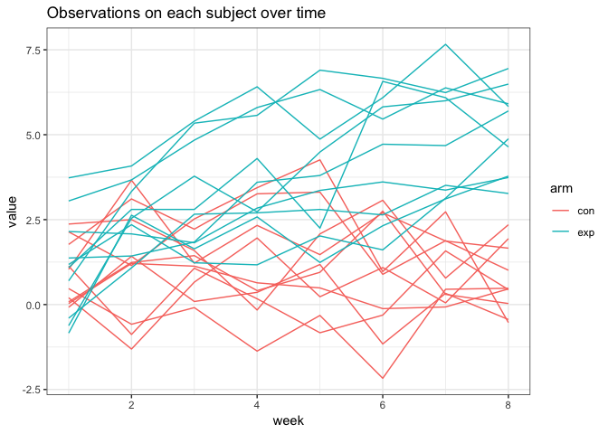

P8105\_hw5\_xy2395
================
Jack Yan
11/2/2018

Problem 1
=========

Data manipulation
-----------------

``` r
data_p1 = 
  list.files("./data/problem_1") %>% 
  as.tibble() %>% 
  mutate(value = str_c("./data/problem_1/", value),
         new_id = 1:20
         )

data_p1 = 
  map(.x = data_p1$value, ~read_csv(.x)) %>%
  mutate(data_p1, data = .) %>% 
  unnest %>% 
  mutate(value = str_replace(value, "./data/problem_1/", "")) %>% 
  mutate(value = str_replace(value, ".csv", "")) %>% 
  separate(value, into = c("arm", "id"), sep = "_") %>% 
  gather(key = week, value = value, week_1:week_8) %>% 
  mutate(week = str_replace(week, "week_", ""),
         arm = as.factor(arm),
         week = as.factor(week),
         id = as.numeric(id) %>% as.factor()
  )

head(data_p1)
```

    ## # A tibble: 6 x 5
    ##   arm   id    new_id week  value
    ##   <fct> <fct>  <int> <fct> <dbl>
    ## 1 con   1          1 1      0.2 
    ## 2 con   2          2 1      1.13
    ## 3 con   3          3 1      1.77
    ## 4 con   4          4 1      1.04
    ## 5 con   5          5 1      0.47
    ## 6 con   6          6 1      2.37

Plot
----

``` r
# plot observations on each subject over time
data_p1 %>% 
  group_by(arm, new_id) %>% 
  ggplot(aes(x = week, y = value, group = new_id, color = arm)) +
  geom_line() +
  labs(
    title = "Observations on each subject over time"
  )
```



Comment: Observations for the experimental group tended to increase over time, whereas observations for the control group did not show trend of increase over time.
