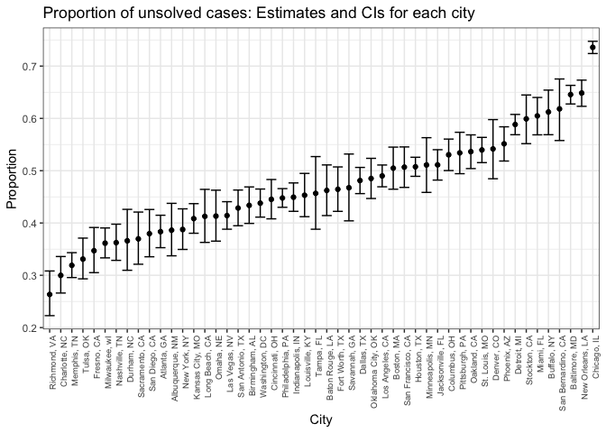

P8105\_hw5\_xy2395
================
Jack Yan
11/2/2018

Problem 1
=========

Data manipulation
-----------------

Create a tidy dataframe containing data from all participants, including the subject ID, arm, and observations over time.

``` r
# Start with a dataframe containing all file names
data_p1 = 
  list.files("./data/problem_1") %>% 
  as.tibble() %>% 
  mutate(value = str_c("./data/problem_1/", value),
         new_id = 1:20
         )

# Iterate over file names and read in data for each subject 
# Save the result as a new variable in the dataframe
data_p1 = 
  map(.x = data_p1$value, ~read_csv(.x)) %>%
  mutate(data_p1, data = .) 

# Tidy the result
data_p1 = 
  data_p1 %>% 
  unnest %>%  
  # manipulate file names to include control arm and subject ID
  mutate(value = str_replace(value, "./data/problem_1/", ""),
         value = str_replace(value, ".csv", "")) %>% 
  separate(value, into = c("arm", "id"), sep = "_") %>% 
  # make sure weekly observations are “tidy”
  gather(key = week, value = value, week_1:week_8) %>% 
  # do other tidying
  mutate(week = str_replace(week, "week_", ""),
         arm = as.factor(arm),
         week = as.integer(week),
         id = as.numeric(id)
  )

head(data_p1)
```

    ## # A tibble: 6 x 5
    ##   arm      id new_id  week value
    ##   <fct> <dbl>  <int> <int> <dbl>
    ## 1 con       1      1     1  0.2 
    ## 2 con       2      2     1  1.13
    ## 3 con       3      3     1  1.77
    ## 4 con       4      4     1  1.04
    ## 5 con       5      5     1  0.47
    ## 6 con       6      6     1  2.37

Plot
----

Make a spaghetti plot showing observations on each subject over time, and comment on differences between groups.

``` r
# plot observations on each subject over time
data_p1 %>% 
  group_by(arm, new_id) %>% 
  ggplot(aes(x = week, y = value, group = new_id, color = arm)) +
  geom_line() +
  theme_bw() +
  labs(
    title = "Observations on each subject over time"
  )
```


Comment:

Observations for the experimental group tended to increase over time, whereas observations for the control group did not show trend of increase over time.

Problem 2
=========

Description
-----------

This dataset contains 52179 observations and 12 variables. Observations denote cases of homicide over the past decade in 50 of the largest American cities. According to Washington Post, "the data included the location of the killing, whether an arrest was made and, in most cases, basic demographic information about each victim." As variable names clealy indicate, the data contain date, victim names, race, age, sex, location and dispostion for each case.

Data Manipulation
-----------------

Create a city\_state variable and then summarize within cities to obtain the total number of homicides and the number of unsolved homicides.

``` r
data_p2 = 
  read_csv("./data/homicide-data.csv") %>% 
  mutate(city_state = str_c(city, ", ", state),
         disposition = as.factor(disposition))

n_total = 
  data_p2 %>% 
  group_by(city_state) %>% 
  count() %>% 
  rename(n_total = n) 

n_unsolved = 
  data_p2 %>% 
  group_by(city_state) %>% 
  filter(disposition != "Closed by arrest") %>% 
  count() %>% 
  rename(n_unsolved = n) 

# The city Tulsa, AL with no unsolved cases will be excluded for further analysis
full_join(n_total, n_unsolved) %>% filter(is.na(n_unsolved) == T)
```

    ## # A tibble: 1 x 3
    ## # Groups:   city_state [1]
    ##   city_state n_total n_unsolved
    ##   <chr>        <int>      <int>
    ## 1 Tulsa, AL        1         NA

``` r
# join numbers of total cases and unsolved cases
count_data = 
  inner_join(n_total, n_unsolved) %>% 
  ungroup()
```

Proportion test for Baltimore, MD
---------------------------------

``` r
# select Baltimore, MD only
sample = 
  count_data %>% 
  filter(city_state == "Baltimore, MD")

# do the proportion test and select results of interest from the tidy summary
prop.test(sample$n_unsolved, sample$n_total) %>% 
  broom::tidy() %>% 
  select(estimate, conf.low, conf.high)
```

    ## # A tibble: 1 x 3
    ##   estimate conf.low conf.high
    ##      <dbl>    <dbl>     <dbl>
    ## 1    0.646    0.628     0.663

Develop a function for further iteraion
---------------------------------------

``` r
# use the name of each city as an argument
custom_prop_test = function(x_city){
  
  sample = 
    count_data %>% 
    filter(city_state == x_city)

  prop.test(sample$n_unsolved, sample$n_total) %>% 
    broom::tidy() %>% 
    select(estimate, conf.low, conf.high)
}
```

Iteration across all the cities
-------------------------------

``` r
prop_data = 
  map(.x = count_data$city_state, ~custom_prop_test(.x)) %>% 
  mutate(count_data, result = .) %>% 
  unnest %>% 
  select(city_state, estimate, conf.low, conf.high)

prop_data
```

    ## # A tibble: 50 x 4
    ##    city_state      estimate conf.low conf.high
    ##    <chr>              <dbl>    <dbl>     <dbl>
    ##  1 Albuquerque, NM    0.386    0.337     0.438
    ##  2 Atlanta, GA        0.383    0.353     0.415
    ##  3 Baltimore, MD      0.646    0.628     0.663
    ##  4 Baton Rouge, LA    0.462    0.414     0.511
    ##  5 Birmingham, AL     0.434    0.399     0.469
    ##  6 Boston, MA         0.505    0.465     0.545
    ##  7 Buffalo, NY        0.612    0.569     0.654
    ##  8 Charlotte, NC      0.300    0.266     0.336
    ##  9 Chicago, IL        0.736    0.724     0.747
    ## 10 Cincinnati, OH     0.445    0.408     0.483
    ## # ... with 40 more rows

Plot
----

Create a plot that shows the estimates and CIs for each city – check out geom\_errorbar for a way to add error bars based on the upper and lower limits. Organize cities according to the proportion of unsolved homicides.

``` r
prop_data %>% 
  mutate(city_state = fct_reorder(city_state, estimate)) %>% 
  ggplot(aes(x = city_state, y = estimate, ymin = conf.low, ymax = conf.high)) +
    geom_point() +
    geom_errorbar() +
    theme_bw() +
    theme(axis.text.x = element_text(angle = 90, hjust = 1, size = rel(0.8))) +
    labs(
      x = "City",
      y = "Proportion",
      title = "Proportion of unsolved cases: Estimates and CIs for each city"
    )
```


